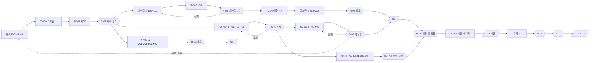

# 12. 구현 그래프 — 검토하고, 틀리면 되돌아간다

> v1 (2026-09-24). 정의는 `.harness/graph.json`, 상태는 `.harness/state.json`, 도구는 `scripts/harness/graph.mjs`.
> 목표: 구현 중간중간 **의도·사용성·코드·데이터**를 검토하고, 틀리면 **가장 가까운 원인 노드(중간)**나 **계획 문서(처음)**로 되돌린다. 되돌린 노드 아래에 있던 완료 작업은 모두 "재검증 필요"가 되어 그냥 지나갈 수 없다.

---

## 1. 노드
| 종류 | id | 뜻 | 누가 완료시키나 |
|---|---|---|---|
| 계획 | `P-03`~`P-11` | 계획 문서(그래프의 뿌리) | 오케스트레이터(문서 수정 + 교차 리뷰) |
| 사람 | `H1`~`H10` | 로그인·서명·설치처럼 사람만 할 수 있는 일 | 사람 → 오케스트레이터가 기록 |
| 작업 | `T-xxx` | 레인별 구현 task(`07` §5) | 워커 → 게이트 1~4 통과 후 오케스트레이터 |
| 검토 | `R-01`~`R-10` | 여러 작업을 묶어 의도·사용성·코드·데이터를 본다 | 교차 리뷰어 + 오케스트레이터 판정 |
| 게이트 | `G1`~`G4` | 일정의 관문(`07` §3) | 오케스트레이터 |

## 2. 상태
`todo` → `running` → `done` 이 기본이다. 그 밖에:
- `failed`: 검토에서 불합격. 반드시 되돌림 대상을 함께 정한다.
- `stale`: 위쪽 노드가 되돌려져서 **다시 확인해야** 하는 완료 노드. 수용 기준을 다시 돌려 통과하면 `done`, 아니면 고친다.
- `blocked`: 사람 작업·외부 사정으로 멈춤.
- **시작 가능** = 선행이 전부 `done`이고 자신이 `todo`·`stale`인 노드(`graph.mjs ready`).

## 3. 검토 노드
| id | 이름 | 종류 | 선행 | 되돌림 후보(가까운 순) |
|---|---|---|---|---|
| R-01 | 계약 검토 | 의도·코드 | T-001 | T-001 → P-09 → P-10 → P-05 |
| R-02 | 백엔드 골격 코드 검토 | 코드 | T-201·T-301·T-501·T-601 | 각 골격 → T-001 |
| R-03 | UI 기반 사용성 검토 | 사용성·코드 | T-401·T-402·T-430 | T-402 → T-401 → T-430 → P-04 |
| R-04 | 데이터·누수 검토 | 데이터·코드 | T-203 | T-203 → T-103 → T-102 → P-06 |
| R-05 | 예보팀 의도 검토 | 의도·코드 | T-305 | T-304 → T-303 → T-602 → T-302 → P-10 → P-09 |
| R-06 | 상담·예보서 사용성 검토 | 사용성·의도 | T-405·T-406 | T-406 → T-405 → T-402 → P-11 → P-04 → P-03 |
| R-07 | 대시보드·3D 사용성·성능 | 사용성·코드 | T-404·T-407·T-433 | T-433 → T-432 → T-431 → T-404 → T-407 → P-04 → P-11 |
| R-08 | 제출 전 종합 검토 | 전부 | G2·R-07·T-207·T-503·T-412a·T-203b·T-206·T-307 | 화면 task → 예보팀 → 데이터 → P-03 → P-11 |
| R-09 | 2주차 기능 사용성 | 사용성·의도 | T-408·T-409·T-410·T-413·T-434 | 각 task → P-11 |
| R-10 | 완성품 최종 검토 | 코드·사용성·의도 | T-412b·T-308·T-309 외 P1 | 각 task → P-11 |
- 검토마다 체크리스트가 `graph.json`에 있다. 사용성 검토는 `11_메뉴_기능_명세.md`의 세부 기능 표와 "화면 구분 원칙" 5개를 그대로 쓴다.

## 4. 검토는 이렇게 한다
1. **증거 모으기**: 대상 task의 리포트·diff·테스트 결과, 화면 task면 Playwright 스크린샷(1366·1920·390 폭, 낮·밤).
2. **교차 리뷰**: 반대 모델 Codex를 읽기 전용으로 돌린다. 화면 검토는 스크린샷을 `-i`로 붙여 보낸다. 결과는 `.harness/reports/R-xx.md`.
3. **오케스트레이터 판정**: 리뷰와 스크린샷을 직접 보고 PASS / FAIL을 정한다. 화면은 눈으로 확인한다(정적 검사만으로 통과시키지 않는다).
4. **기록**: PASS → `graph.mjs done R-xx --evidence "…"`. FAIL → `graph.mjs fail R-xx --to <대상> --reason "…"`.

**되돌림 대상 고르는 법**
| 결함이 어디서 왔나 | 되돌릴 곳 | 예 |
|---|---|---|
| 한 task의 구현 실수 | 그 task | 버튼이 두 개 다 채운 색 → T-406 |
| 공용 부품·셸의 문제 | 공용 task | 모든 화면 여백이 같음 → T-402 |
| 계약(스키마)이 틀림 | T-001 | 근거에 단위 필드가 없음 |
| 계획 자체가 의도와 다름 | 해당 `P-xx` | 메뉴 구성이 사용자에게 헷갈림 → P-11 |
- 계획 노드를 되돌리면 문서를 먼저 고치고 교차 리뷰를 받은 뒤 `done`으로 올린다. 그러면 그 아래가 전부 `stale`이 되어 순서대로 다시 확인된다.
- 같은 검토가 두 번 실패하면 한 단계 위(더 뿌리 쪽)를 의심한다.

## 5. 백업
- 검토나 게이트를 통과할 때마다 레인 브랜치를 **develop**에 병합하고 `origin/develop`에 push한다(사용자 결정 2026-09-24). `main`은 제출 직전 PR로만 반영한다.
- `state.json`도 커밋한다. 누가 언제 무엇을 되돌렸는지 git 기록으로 남는다.

## 6. 명령
```bash
node scripts/harness/graph.mjs validate            # 정의 검사: 중복·없는 선행·순환·되돌림 대상·검토를 피해 가는 노드
node scripts/harness/graph.mjs status [--lane L4a]  # 상태 요약 + 시작 가능 노드
node scripts/harness/graph.mjs ready                # 지금 시작할 수 있는 노드
node scripts/harness/graph.mjs start T-401
node scripts/harness/graph.mjs done T-401 --evidence "npm run build 통과, 스크린샷 …"
node scripts/harness/graph.mjs fail R-03 --to T-402 --reason "메뉴 현재 위치가 안 보임"
node scripts/harness/graph.mjs reopen P-11 --reason "메뉴 구성 변경"
node scripts/harness/graph.mjs mermaid > reports/figures/graph.mmd
```

## 7. 뼈대 (검토·게이트만 그린 요약)

